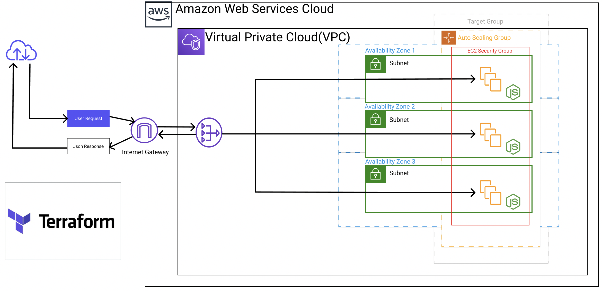

# AWS Auto-Scaling Web Infrastructure (ASWI)

> A Terraform project for deploying highly available and scalable web infrastructure on AWS

This repository contains Terraform configurations to deploy a scalable AWS infrastructure with an Application Load Balancer (ALB) and Auto Scaling Group (ASG).



## Architecture Overview

This project sets up the following AWS resources:

- VPC with public subnets
- Internet Gateway and routing
- Application Load Balancer (ALB)
- Auto Scaling Group with Launch Template
- Security Groups for ALB and EC2 instances
- Key Pair for EC2 instance access

## Prerequisites

- [Terraform](https://www.terraform.io/downloads.html) (v0.12 or later)
- AWS CLI configured with appropriate credentials
- Git

## Project Structure

```
.
├── main.tf              # Main Terraform configuration
├── variables.tf         # Variable declarations
├── terraform.tfvars     # Variable values
├── outputs.tf           # Output definitions
├── provider.tf          # AWS provider configuration
└── modules/
    ├── vpc_module/            # VPC configuration
    ├── subnet_module/         # Subnet configurations
    ├── internet_gateway/      # IGW configuration
    ├── route_table/          # Route table configuration
    ├── aws_routes/           # Route configurations
    ├── security_group_ec2/   # EC2 security group
    ├── security_group_alb/   # ALB security group
    ├── aws_alb/             # ALB configuration
    ├── target_group/        # Target group configuration
    ├── aws_alb_listener/    # ALB listener configuration
    ├── aws_lt/             # Launch template configuration
    ├── key_pair/           # Key pair configuration
    └── aws_asg/            # Auto Scaling Group configuration
```

## Configuration

1. Clone this repository:

```bash
git clone <repository-url>
cd <repository-name>
```

2. Create a `terraform.tfvars` file with your specific values:

```hcl
aws_region = "your-region"
aws_creds = "your-credentials-file"
vpc_cidr = "10.0.0.0/16"
subnets = {
  "subnet1" = "10.0.1.0/24"
  "subnet2" = "10.0.2.0/24"
}
instance_type = "t2.micro"
ami_id = "ami-xxxxx"
git_repo = "your-application-repo"
asg_desired_capicty = 2
asg_max_size = 4
asg_min_size = 1
```

## Usage

1. Initialize Terraform:

```bash
terraform init
```

2. Review the planned changes:

```bash
terraform plan
```

3. Apply the configuration:

```bash
terraform apply
```

4. To destroy the infrastructure:

```bash
terraform destroy
```

## Security

- The ALB is configured in public subnets
- EC2 instances are protected by security groups
- SSH access is controlled via key pairs
- All sensitive variables should be managed securely

## Contributing

1. Fork the repository
2. Create your feature branch
3. Commit your changes
4. Push to the branch
5. Create a new Pull Request

## License

This project is open source and available under the [MIT License](LICENSE).

## Support

For support, please open an issue in the GitHub repository.
